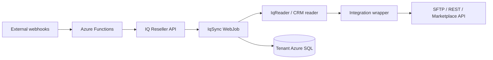

# System Map

IQ Connect is organized around a hub-and-spoke model. `IqSync` is the hub, and each partner/customer integration is a spoke that translates IQ Reseller data into external protocols and formats.

## Core Flow

## Main Components

| Component | Role |
| --- | --- |
| `IqSync` | Command-line orchestration engine deployed as Azure WebJobs. |
| `CheatSheet` | Runtime settings object for tenant, IQ API, Azure, and integration configuration. |
| `IqReader` | Reads IQ Reseller source data and feed-specific SQL/API query results. |
| Integration wrappers | Format partner-specific payloads for Best Buy, SPS, HubSpot, Channable, and other integrations. |
| `VssLastMile` | Azure service used for SQL query execution and SFTP marshaling. |
| Azure Functions | Receive webhook-style inbound events, especially HubSpot quote flows. |
| `iqconnect_*` tables | Store sync state, mappings, feed history, resend queues, and CRM tracking. |

## Active Integrations

| Integration | Customer | Purpose |
| --- | --- | --- |
| Best Buy Symphony | PARTpoint | Catalog, inventory, pricing, POs, SO updates, ASN, invoices, returns, and cancellations. |
| SPS Commerce | OSI Global | EDI order, shipment, invoice, and acknowledgement workflow. |
| HubSpot | DHD, OSI Global, and others | CRM company/contact/deal sync plus quote-to-order webhooks. |
| Channable | Renewtech | Product catalog feed for marketplace distribution. |

## Direction Conventions

| Command Prefix | Direction | Example |
| --- | --- | --- |
| `from-bestbuy` | Best Buy to IQ Reseller | Best Buy sends a PO to IQ. |
| `to-bestbuy` | IQ Reseller to Best Buy | IQ sends ASN, invoices, catalog, or ETA updates. |
| `from-sps` / `to-sps` | Bidirectional with SPS Commerce | SPS orders in; ASN and invoices out. |
| `to-hubspot` | IQ Reseller to HubSpot | Deals, companies, contacts, and gross margin sync. |
| `to-channable` | IQ Reseller to Channable | Catalog feed generation. |

## Design Principles

- WebJobs run unattended on schedules or by manual support command.
- Most data movement stays inside Azure until the final partner handoff.
- Tenant context is resolved at runtime from command arguments and tenant configuration.
- Delta mode is preferred for recurring feeds; reset mode is reserved for full reloads.
- Mirror files and feed history are the first stop for support evidence.
